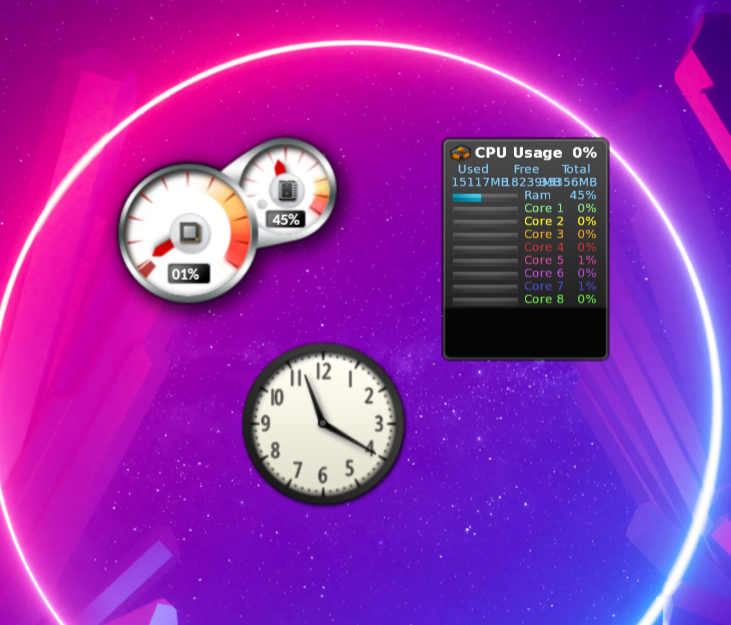

Gadgets for Linux
=================

Software preservation effort for fun to make the original .gadget files from Windows Vista and
Windows 7 work on Linux.

Gadgets are a collection of web resources, hence this project uses WebKit embedded in GTK along
with a bunch of polyfills to mimic the Microsoft API's.

Verified working gadgets:
* MS Clock
* MS CPU Gauge
* AddGadgets All CPU Meter v1.3 (graph still missing)

The gadget files are still subject to copyright as far as I am aware, so I am hesitant to include
them here. However, they can be downloaded from
[archive.org](http://web.archive.org/web/20111221105443/http://windows.microsoft.com/en-US/windows/downloads/personalize/gadgets)
and [here](https://lelegofrog.github.io/wingadgets7.html)
